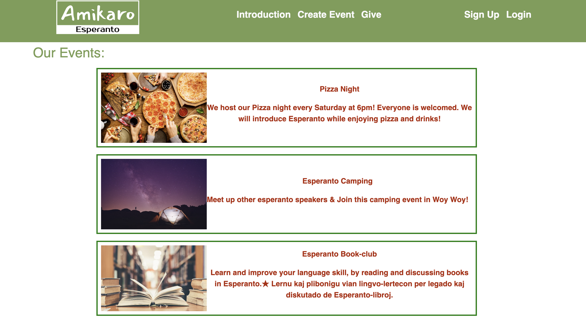
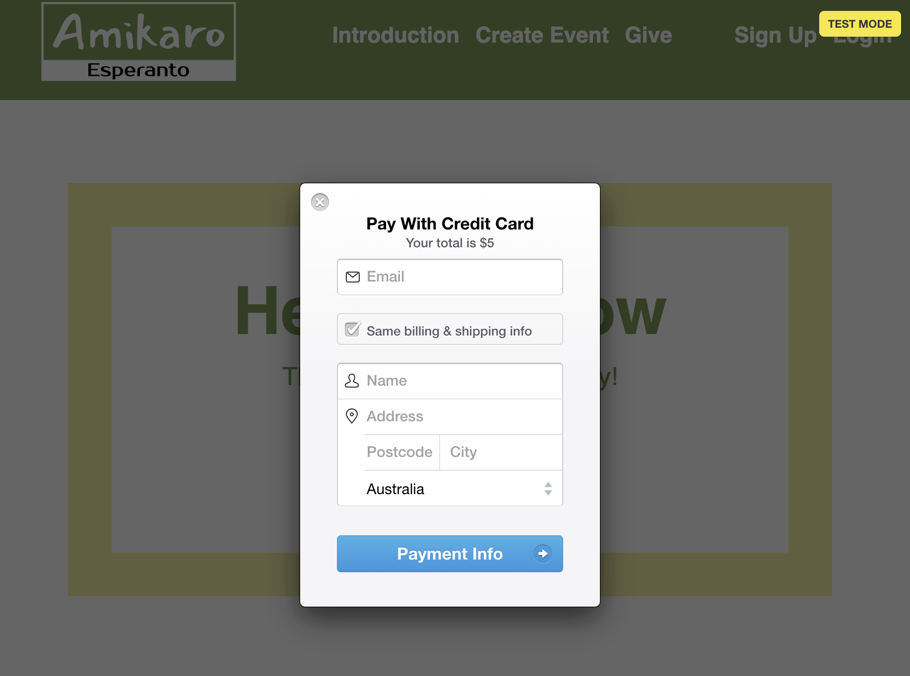

# Amikaro

## Table of Contents

- [Description](#description)
- [Tech Stack](#tech-stack)
- [Features](#features)
- [Installation](#installation)
- [Getting Started](#getting-started)
- [Screenshot](#screenshot)
- [Links](#links)
- [License](#license)

## Description

Amikaro is a web application that provides a platform for Esperanto speakers and those interested in or curious about Esperanto to connect, meet up, and practice the language together. The app allows users to create accounts, host their own Esperanto events (either locally or online meetups), and delete their events if needed. Visitors can also contribute by making donations to support the development and maintenance of the app.

Esperanto is an international auxiliary language designed to be easy to learn, promoting communication and understanding among people from different linguistic backgrounds. Amikaro seeks to foster a welcoming and inclusive environment for all Esperanto enthusiasts, enabling them to find like-minded individuals to practice and socialize with.

## Tech Stack

    
    
    
    
    
 

## Features

- User Account Creation: Users can sign up and create their personal accounts on Amikaro.
- Event Hosting: Registered users can host and manage Esperanto events including creating events and deleting events.
- Donation Support: Visitors and users can contribute financially through donations to support the app's development and maintenance.

## Installation

- Node.js
- Express
- NPM
- MongoDB
- Stripe account

## Getting Started

- Creating an Account
  - Navigate to the Amikaro website.
  - Click on the "Sign Up" button to create a new account.
  - Provide the required details, including a valid email address and a secure password.
  - Once the account is created, log in with your credentials to access the full features of the app.
- Hosting Esperanto Events
  - After logging in, click on the "Create Event" button.
  - Fill in the event details, such as event title, information (if it's a local meetup), or platform link (for online meetups).
  - Submit the event to make it visible to other users.
- Donations
   
  Amikaro relies on the support of generous individuals to maintain and improve its services. If you would like to contribute to the app's development, you can make a donation by following these steps:
  - Visit the "Give" page on the Amikaro website.
  - Click "donate" button
  - Provide the necessary payment details to complete the transaction.

## Screenshot

## Links

- GitHub: https://github.com/Chenson92/Amikaro
- Heroku:

## License

Amikaro is licensed under the MIT License.
[License](https://opensource.org/licenses/MIT)

##

 
Thank you for using Amikaro! We hope this platform brings Esperanto speakers and enthusiasts closer together, promoting language exchange and meaningful connections.
